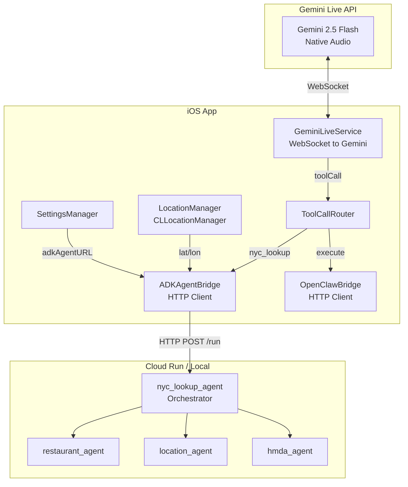
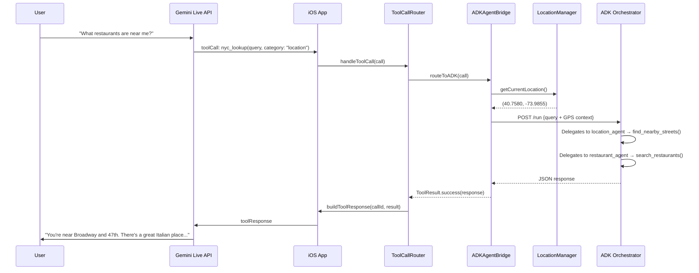
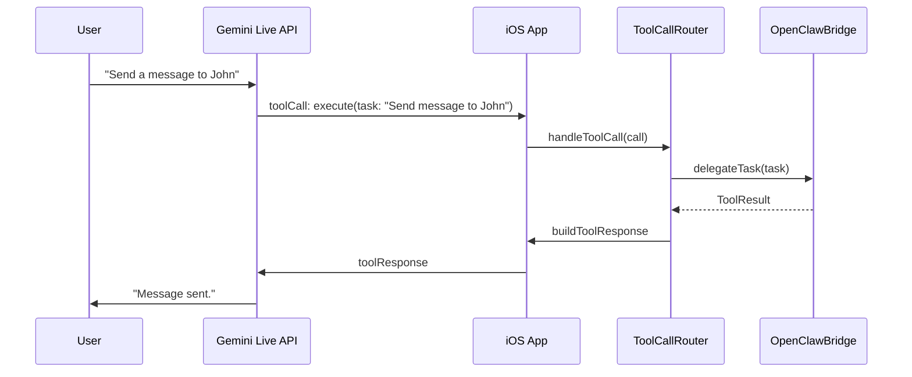

# Design Document: Pixel Glass ADK Agent Integration

## Overview

This feature integrates three existing Google ADK agents (restaurant_agent, location_agent, hmda_agent) with the Pixel Glass iOS app by adding a direct A2A (Agent-to-Agent) HTTP bridge that bypasses OpenClaw. The iOS app declares a new `nyc_lookup` tool to Gemini that routes queries to the ADK orchestrator agent running on Cloud Run (or locally via `adk api_server`). For location queries, the app automatically attaches device GPS coordinates so the location_agent can perform spatial street lookups without the user needing to state their position.

The integration preserves the existing OpenClaw path as a fallback for non-NYC queries. Gemini's system prompt is updated to understand NYC-specific capabilities and route appropriately between the two tools: `execute` (OpenClaw, general tasks) and `nyc_lookup` (ADK agents, NYC data).

## Architecture



## Sequence Diagrams

### NYC Query Flow (e.g., "What restaurants are near me?")



### General Query Flow (Falls through to OpenClaw)



## Components and Interfaces

### Component 1: ADKAgentBridge

**Purpose**: HTTP client that communicates with the ADK orchestrator agent's A2A endpoint. Handles request construction, GPS context injection, and response parsing.

**Interface**:
```swift
@MainActor
class ADKAgentBridge: ObservableObject {
    @Published var connectionState: ADKConnectionState
    @Published var lastToolCallStatus: ToolCallStatus

    func checkConnection() async
    func sendQuery(query: String, category: String?, location: CLLocation?) async -> ToolResult
}

enum ADKConnectionState: Equatable {
    case notConfigured
    case checking
    case connected
    case unreachable(String)
}
```

**Responsibilities**:
- Construct A2A-compatible HTTP POST requests to the orchestrator
- Inject GPS coordinates into the query context when available
- Parse JSON responses from the ADK agent
- Support configurable base URL (local `adk api_server` or Cloud Run)
- Report connection state for UI feedback

### Component 2: LocationManager

**Purpose**: Wraps CLLocationManager to provide on-demand GPS coordinates for location-aware queries.

**Interface**:
```swift
class LocationManager: NSObject, ObservableObject, CLLocationManagerDelegate {
    @Published var lastLocation: CLLocation?
    @Published var authorizationStatus: CLAuthorizationStatus

    func requestPermission()
    func getCurrentLocation() -> CLLocation?
}
```

**Responsibilities**:
- Request location permissions on first use
- Provide last-known GPS coordinates on demand (no continuous tracking)
- Expose authorization status for UI gating

### Component 3: ToolCallRouter (Modified)

**Purpose**: Extended to route tool calls to either OpenClawBridge or ADKAgentBridge based on the tool name.

**Interface change**:
```swift
@MainActor
class ToolCallRouter {
    private let openClawBridge: OpenClawBridge
    private let adkBridge: ADKAgentBridge
    private let locationManager: LocationManager

    init(openClawBridge: OpenClawBridge, adkBridge: ADKAgentBridge, locationManager: LocationManager)

    func handleToolCall(_ call: GeminiFunctionCall, sendResponse: @escaping ([String: Any]) -> Void)
}
```

**Routing logic**:
- `call.name == "nyc_lookup"` → route to `ADKAgentBridge.sendQuery()`
- `call.name == "execute"` → route to `OpenClawBridge.delegateTask()` (existing behavior)

### Component 4: ToolDeclarations (Modified)

**Purpose**: Extended to declare the `nyc_lookup` tool alongside the existing `execute` tool in the Gemini setup message.

### Component 5: SettingsManager (Modified)

**Purpose**: Extended with ADK agent URL configuration field.

### Component 6: GeminiConfig (Modified)

**Purpose**: Extended with ADK-specific configuration accessors and an updated system prompt.

## Data Models

### A2A Request Format

The ADK `api_server` exposes a `/run` endpoint that accepts this JSON structure:

```swift
struct ADKRunRequest: Encodable {
    let appName: String       // "agents"
    let userId: String        // stable device identifier
    let sessionId: String     // per-session UUID
    let newMessage: ADKMessage

    struct ADKMessage: Encodable {
        let role: String      // "user"
        let parts: [ADKPart]
    }

    struct ADKPart: Encodable {
        let text: String
    }

    enum CodingKeys: String, CodingKey {
        case appName = "app_name"
        case userId = "user_id"
        case sessionId = "session_id"
        case newMessage = "new_message"
    }
}
```

**Validation Rules**:
- `appName` must be `"agents"` (matches the ADK project directory name)
- `userId` must be non-empty, stable across sessions (use device UUID)
- `sessionId` must be a valid UUID, regenerated per Gemini session
- `newMessage.parts` must contain at least one part with non-empty text

### A2A Response Format

```swift
struct ADKRunResponse: Decodable {
    let content: [ADKResponsePart]?
    let error: String?

    struct ADKResponsePart: Decodable {
        let text: String?
        let type: String?
    }
}
```

### GPS-Enriched Query Construction

When the `category` argument is `"location"` or the query mentions location-related terms, the bridge prepends GPS context:

```swift
// Input query: "What streets are near me?"
// With GPS (40.7580, -73.9855):
// Enriched: "User's current GPS location: latitude=40.7580, longitude=-73.9855. What streets are near me?"
```

## Algorithmic Pseudocode

### Tool Call Routing Algorithm

```swift
func handleToolCall(_ call: GeminiFunctionCall, sendResponse: @escaping ([String: Any]) -> Void) {
    let callId = call.id
    let callName = call.name

    let task = Task { @MainActor in
        let result: ToolResult

        switch callName {
        case "nyc_lookup":
            let query = call.args["query"] as? String ?? ""
            let category = call.args["category"] as? String
            let location = locationManager.getCurrentLocation()
            result = await adkBridge.sendQuery(query: query, category: category, location: location)

        case "execute":
            let taskDesc = call.args["task"] as? String ?? ""
            result = await openClawBridge.delegateTask(task: taskDesc, toolName: callName)

        default:
            result = .failure("Unknown tool: \(callName)")
        }

        guard !Task.isCancelled else { return }
        let response = buildToolResponse(callId: callId, name: callName, result: result)
        sendResponse(response)
    }

    inFlightTasks[callId] = task
}
```

**Preconditions:**
- `call.id` is non-empty and unique within the session
- `call.name` is one of `"nyc_lookup"` or `"execute"`
- For `nyc_lookup`: `call.args["query"]` contains a non-empty string

**Postconditions:**
- Exactly one `sendResponse` call is made per non-cancelled tool call
- The response contains the original `callId` for Gemini correlation
- `inFlightTasks` is cleaned up after completion

### ADK Bridge Query Algorithm

```swift
func sendQuery(query: String, category: String?, location: CLLocation?) async -> ToolResult {
    // PRECONDITION: query is non-empty, adkBaseURL is configured

    guard let url = buildRunURL() else {
        return .failure("ADK agent URL not configured")
    }

    // Step 1: Enrich query with GPS if location-relevant
    var enrichedQuery = query
    if let loc = location, isLocationRelevant(query: query, category: category) {
        enrichedQuery = "User's current GPS location: latitude=\(loc.coordinate.latitude), "
            + "longitude=\(loc.coordinate.longitude). \(query)"
    }

    // Step 2: Build A2A request
    let request = ADKRunRequest(
        appName: "agents",
        userId: deviceUserId,
        sessionId: currentSessionId,
        newMessage: .init(role: "user", parts: [.init(text: enrichedQuery)])
    )

    // Step 3: Send HTTP POST
    var urlRequest = URLRequest(url: url)
    urlRequest.httpMethod = "POST"
    urlRequest.setValue("application/json", forHTTPHeaderField: "Content-Type")
    urlRequest.httpBody = try? JSONEncoder().encode(request)

    // Step 4: Parse response
    let (data, httpResponse) = try await session.data(for: urlRequest)
    guard let status = (httpResponse as? HTTPURLResponse)?.statusCode,
          (200...299).contains(status) else {
        return .failure("ADK agent returned HTTP \(status)")
    }

    // Step 5: Extract text from response events
    let text = extractTextFromResponse(data)
    return .success(text)

    // POSTCONDITION: Returns .success with agent text or .failure with error description
}

private func isLocationRelevant(query: String, category: String?) -> Bool {
    if category == "location" { return true }
    let locationKeywords = ["near me", "nearby", "around here", "where am i",
                            "this street", "this area", "close to me", "my location"]
    let lower = query.lowercased()
    return locationKeywords.contains { lower.contains($0) }
}
```

**Preconditions:**
- `query` is non-empty
- ADK base URL is configured in SettingsManager
- Network is reachable

**Postconditions:**
- Returns `.success(text)` with the agent's text response
- Returns `.failure(message)` if URL not configured, network error, or non-2xx status
- GPS coordinates are only injected when location is relevant to the query
- No side effects on input parameters

**Loop Invariants:** N/A (no loops in main flow)


### Response Parsing Algorithm

The ADK `api_server` `/run` endpoint returns server-sent events (SSE) where each line is a JSON object. The final event contains the agent's text response.

```swift
private func extractTextFromResponse(_ data: Data) -> String {
    // ADK api_server returns SSE-style: each line is "data: {json}\n"
    // or plain JSON array depending on endpoint version
    guard let raw = String(data: data, encoding: .utf8) else {
        return "Unable to parse response"
    }

    var texts: [String] = []

    // Try SSE format first (data: {...}\n lines)
    let lines = raw.components(separatedBy: "\n")
    for line in lines {
        let trimmed = line.trimmingCharacters(in: .whitespaces)
        guard trimmed.hasPrefix("data:") else { continue }
        let jsonStr = String(trimmed.dropFirst(5)).trimmingCharacters(in: .whitespaces)
        guard let jsonData = jsonStr.data(using: .utf8),
              let json = try? JSONSerialization.jsonObject(with: jsonData) as? [String: Any],
              let content = json["content"] as? [String: Any],
              let parts = content["parts"] as? [[String: Any]] else { continue }
        for part in parts {
            if let text = part["text"] as? String, !text.isEmpty {
                texts.append(text)
            }
        }
    }

    // Fallback: try parsing as plain JSON
    if texts.isEmpty, let json = try? JSONSerialization.jsonObject(with: data) {
        if let arr = json as? [[String: Any]] {
            for event in arr {
                if let content = event["content"] as? [String: Any],
                   let parts = content["parts"] as? [[String: Any]] {
                    for part in parts {
                        if let text = part["text"] as? String { texts.append(text) }
                    }
                }
            }
        } else if let dict = json as? [String: Any],
                  let text = dict["text"] as? String {
            texts.append(text)
        }
    }

    return texts.isEmpty ? "No response from agent" : texts.joined(separator: "\n")
}
```

**Preconditions:**
- `data` is non-nil response body from the ADK endpoint
- Response is either SSE format or plain JSON

**Postconditions:**
- Returns concatenated text from all response parts
- Returns fallback message if no text could be extracted
- Never throws; always returns a String

## Key Functions with Formal Specifications

### nyc_lookup Tool Declaration

```swift
static let nycLookup: [String: Any] = [
    "name": "nyc_lookup",
    "description": """
        Query NYC-specific data: restaurant health inspections, street/location lookups, \
        and mortgage lending analysis. Use this for ANY question about New York City \
        restaurants, streets, neighborhoods, boroughs, or mortgage data. The system has \
        access to live NYC Open Data and HMDA filings.
        """,
    "parameters": [
        "type": "object",
        "properties": [
            "query": [
                "type": "string",
                "description": "The user's question about NYC data. Be specific and include all relevant details."
            ],
            "category": [
                "type": "string",
                "enum": ["restaurant", "location", "mortgage", "general"],
                "description": "Category hint: 'restaurant' for food/dining, 'location' for streets/navigation, 'mortgage' for lending data, 'general' for mixed queries."
            ]
        ],
        "required": ["query"]
    ] as [String: Any]
]
```

### Updated System Prompt

```swift
static let defaultSystemInstruction = """
    You are an AI assistant for someone wearing Meta Ray-Ban smart glasses in New York City. \
    You can see through their camera and have a voice conversation. Keep responses concise and natural.

    You have TWO tools:

    1. **nyc_lookup** — For NYC-specific questions. Use this when the user asks about:
       - Restaurants, food, dining, health grades, inspections (category: "restaurant")
       - Streets, directions, navigation, "where am I", nearby places (category: "location")
       - Mortgage lending, loan approvals, HMDA data, lending disparities (category: "mortgage")
       - Any combination of the above (category: "general")
       The system has live NYC Open Data and street geometry. For location queries, GPS \
       coordinates are automatically attached — just pass the user's question as-is.

    2. **execute** — For everything else: sending messages, web searches, reminders, notes, \
       smart home control, app interactions, or any non-NYC request.

    ROUTING RULES:
    - NYC restaurant question → nyc_lookup with category "restaurant"
    - "What street is this?" / "Where am I?" / navigation → nyc_lookup with category "location"
    - Mortgage/lending question → nyc_lookup with category "mortgage"
    - "Send a message" / "Search the web" / general tasks → execute
    - When in doubt about NYC data, try nyc_lookup first.

    IMPORTANT: Before calling any tool, ALWAYS speak a brief acknowledgment first.
    Never call a tool silently — the user needs verbal confirmation.
    """
```

## Example Usage

### Example 1: Restaurant Query

```swift
// Gemini sends tool call:
// { "toolCall": { "functionCalls": [{ "id": "abc123", "name": "nyc_lookup",
//   "args": { "query": "Find Italian restaurants in SoHo with grade A", "category": "restaurant" } }] } }

// ToolCallRouter routes to ADKAgentBridge:
let result = await adkBridge.sendQuery(
    query: "Find Italian restaurants in SoHo with grade A",
    category: "restaurant",
    location: nil  // No GPS needed for restaurant name search
)
// → .success("Found 5 Italian restaurants in SoHo with A grades: ...")
```

### Example 2: Location Query with GPS

```swift
// User asks: "What street am I on?"
// Gemini sends: nyc_lookup(query: "What street am I on?", category: "location")

let location = locationManager.getCurrentLocation()  // CLLocation(40.7580, -73.9855)
let result = await adkBridge.sendQuery(
    query: "What street am I on?",
    category: "location",
    location: location
)
// Bridge enriches query to:
// "User's current GPS location: latitude=40.7580, longitude=-73.9855. What street am I on?"
// → .success("You're on Broadway near West 47th Street in Midtown Manhattan...")
```

### Example 3: Fallback to OpenClaw

```swift
// User asks: "Send a message to John on WhatsApp"
// Gemini sends: execute(task: "Send a message to John on WhatsApp")

// ToolCallRouter routes to OpenClawBridge (existing path):
let result = await openClawBridge.delegateTask(task: "Send a message to John on WhatsApp")
```

### Example 4: Settings Configuration

```swift
// In Settings, user configures ADK agent URL:
// Local development: "http://macbook.local:8080"
// Cloud Run: "https://agents-xxxx-uc.a.run.app"

let settings = SettingsManager.shared
settings.adkAgentURL = "http://macbook.local:8080"  // or Cloud Run URL
// ADKAgentBridge reads this to construct: POST {adkAgentURL}/run
```

## Correctness Properties

*A property is a characteristic or behavior that should hold true across all valid executions of a system-essentially, a formal statement about what the system should do. Properties serve as the bridge between human-readable specifications and machine-verifiable correctness guarantees.*

### Property 1: Tool routing determinism

*For any* tool call with a given name, the ToolCallRouter always routes `"nyc_lookup"` to ADKAgentBridge, `"execute"` to OpenClawBridge, and any other name to a failure result. No tool call is ever routed to both bridges.

**Validates: Requirements 2.1, 2.2, 2.3**

### Property 2: GPS enrichment when location-relevant

*For any* query where `category == "location"` or the query text contains a location keyword (e.g., "near me", "nearby", "where am I"), and a GPS location is available, the enriched query sent to the ADK agent contains the GPS latitude and longitude coordinates prepended to the original query text.

**Validates: Requirements 3.1, 3.2**

### Property 3: GPS non-enrichment when not location-relevant

*For any* query where the category is not `"location"` and the query text contains no location keywords, or where no GPS location is available, the query sent to the ADK agent is identical to the original query text.

**Validates: Requirements 3.3, 3.4**

### Property 4: HTTP status to result type mapping

*For any* HTTP response from the ADK agent, a 2xx status code produces a `ToolResult.success`, a non-2xx status code produces a `ToolResult.failure` containing the status code, and a network error produces a `ToolResult.failure` with an error description. The app never crashes regardless of the response.

**Validates: Requirements 1.3, 1.4, 1.5**

### Property 5: A2A request construction validity

*For any* query string sent through ADKAgentBridge, the serialized A2A request JSON contains `app_name` equal to `"agents"`, a non-empty `user_id`, a valid UUID `session_id`, and a `new_message` with the query text. The request URL is the configured base URL appended with `/run`.

**Validates: Requirements 1.1, 1.2**

### Property 6: Response parsing robustness

*For any* byte sequence received as a response body, `extractTextFromResponse` returns a non-nil String without throwing. Valid SSE-formatted and plain JSON responses produce the same extracted text content.

**Validates: Requirement 1.6**

### Property 7: One response per non-cancelled tool call

*For any* tool call that is not cancelled, the ToolCallRouter sends exactly one `toolResponse` to Gemini containing the original `callId`.

**Validates: Requirement 2.4**

### Property 8: Health check state correctness

*For any* health check outcome, a 2xx HTTP response sets the connection state to `connected`, and any error or non-2xx response sets the state to `unreachable` with an error description.

**Validates: Requirements 7.3, 7.4**

### Property 9: User ID stability

*For any* number of reads of the `userId` property across app launches, the returned value is always the same UUID string.

**Validates: Requirement 8.1**

### Property 10: Session ID uniqueness

*For any* two distinct Gemini session starts, the generated `sessionId` values are different UUIDs.

**Validates: Requirement 8.2**

## Error Handling

### Error Scenario 1: ADK Agent Unreachable

**Condition**: HTTP request to ADK endpoint fails (network error, DNS failure, timeout)
**Response**: Return `ToolResult.failure("ADK agent unreachable: <error>")` to Gemini
**Recovery**: Gemini tells the user the NYC data service is unavailable. User can retry or use `execute` for general queries. UI shows `ADKConnectionState.unreachable`.

### Error Scenario 2: ADK Agent Returns Non-2xx

**Condition**: ADK endpoint returns 4xx/5xx status code
**Response**: Return `ToolResult.failure("ADK agent returned HTTP <code>")` to Gemini
**Recovery**: Same as above. Common causes: 404 (wrong URL), 500 (agent error), 503 (Cloud Run cold start timeout).

### Error Scenario 3: Location Permission Denied

**Condition**: User has not granted location permission, and a location query is made
**Response**: Query is sent without GPS enrichment. The agent may ask the user to specify their location verbally.
**Recovery**: App can prompt for location permission on next location query. Non-location queries are unaffected.

### Error Scenario 4: Malformed Agent Response

**Condition**: ADK response is not valid JSON or missing expected fields
**Response**: Return `ToolResult.failure("Unable to parse agent response")`
**Recovery**: Gemini informs the user. The response parser has multiple fallback strategies (SSE, plain JSON, raw text).

### Error Scenario 5: Tool Call Cancelled (User Interruption)

**Condition**: User speaks while a tool call is in flight, triggering `toolCallCancellation`
**Response**: In-flight HTTP task is cancelled via `Task.cancel()`. No response sent to Gemini.
**Recovery**: Existing cancellation logic in ToolCallRouter handles this identically to OpenClaw cancellations.

## Testing Strategy

### Unit Testing Approach

- **ADKAgentBridge**: Mock URLSession to test request construction, GPS enrichment logic, response parsing (SSE and JSON formats), error handling for various HTTP status codes
- **ToolCallRouter**: Verify routing logic — `nyc_lookup` → ADK, `execute` → OpenClaw, unknown → error
- **LocationManager**: Test authorization state transitions, location availability
- **isLocationRelevant()**: Test keyword matching with various query strings and categories

### Property-Based Testing Approach

**Property Test Library**: swift-testing with custom generators (or SwiftCheck if available)

- **GPS enrichment idempotency**: For any query string and location, enriching twice produces the same result as enriching once
- **Routing determinism**: For any tool call name, routing always produces the same destination
- **Response parsing robustness**: For any byte sequence, `extractTextFromResponse` never crashes and always returns a String

### Integration Testing Approach

- Start local `adk api_server --port 8080 agents` and verify end-to-end query flow
- Test with real GPS coordinates against the location_agent's `find_nearby_streets`
- Verify Cloud Run deployment responds correctly to the same request format
- Test concurrent tool calls (NYC + OpenClaw) don't interfere

## Performance Considerations

- ADK agent cold starts on Cloud Run can take 5-10 seconds (centerline GeoJSON loading). The 120-second timeout on the HTTP client accommodates this. Consider Cloud Run min-instances=1 for production.
- GPS location is read from `CLLocationManager.location` (cached), not requested fresh each time. This avoids blocking on GPS fix.
- The A2A request/response is a single HTTP round-trip per query. No streaming is needed since Gemini handles the voice streaming layer.

## Security Considerations

- The ADK agent URL should use HTTPS in production (Cloud Run provides this by default).
- No authentication token is currently required for the ADK `api_server` endpoint. For Cloud Run, consider adding IAM authentication or a bearer token.
- GPS coordinates are sent to the agent server. Users should be informed that location data is transmitted when using location features.
- The `userId` is a stable device identifier — avoid using IDFV or other trackable identifiers. A random UUID stored in UserDefaults is sufficient.

## Dependencies

- **CoreLocation**: iOS framework for GPS coordinates (already available, no additional dependency)
- **Google ADK**: Python server-side, already deployed. No changes needed to the agents themselves.
- **URLSession**: iOS networking, already used by OpenClawBridge. No additional networking library needed.
- **No new Swift packages required** — the integration uses only Foundation and CoreLocation.
